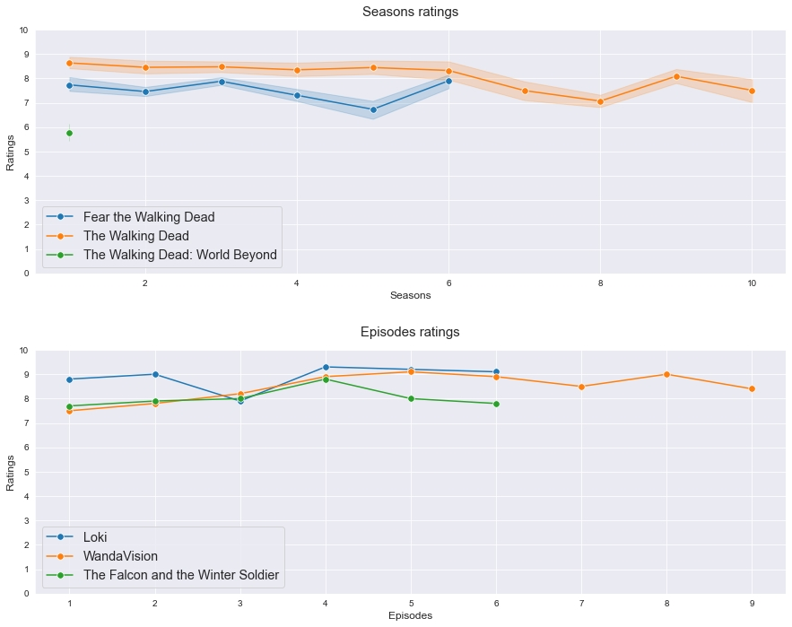

# TV Shows Visualizations
This is a tiny project with web scraping and data visualization.

Basically, my goal is to be able to compare episodes or seasons from different TV shows with just one function.

The result is a visualization based on ratings of episodes from [imdb](https://www.imdb.com).

